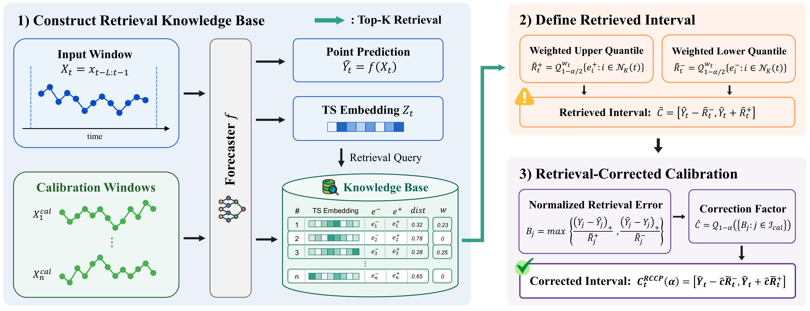
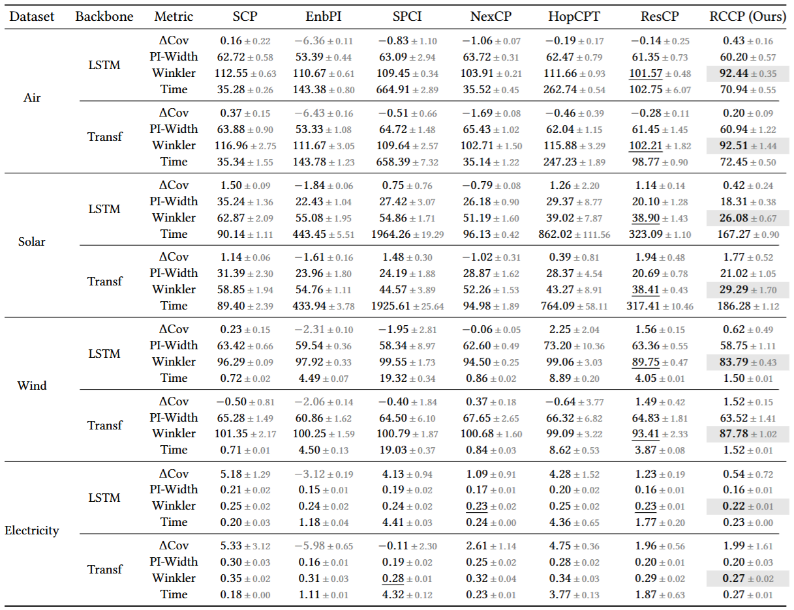
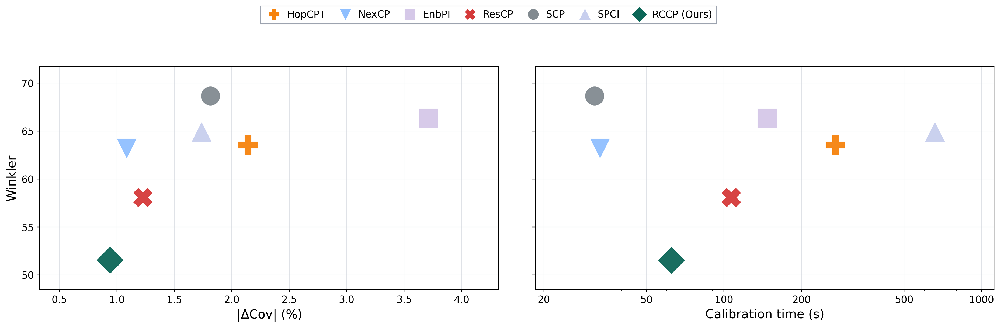
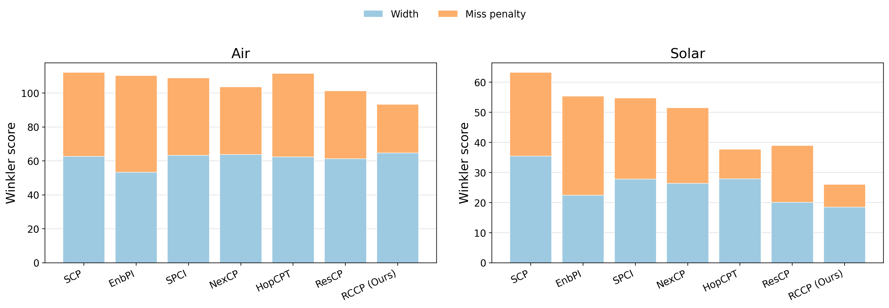
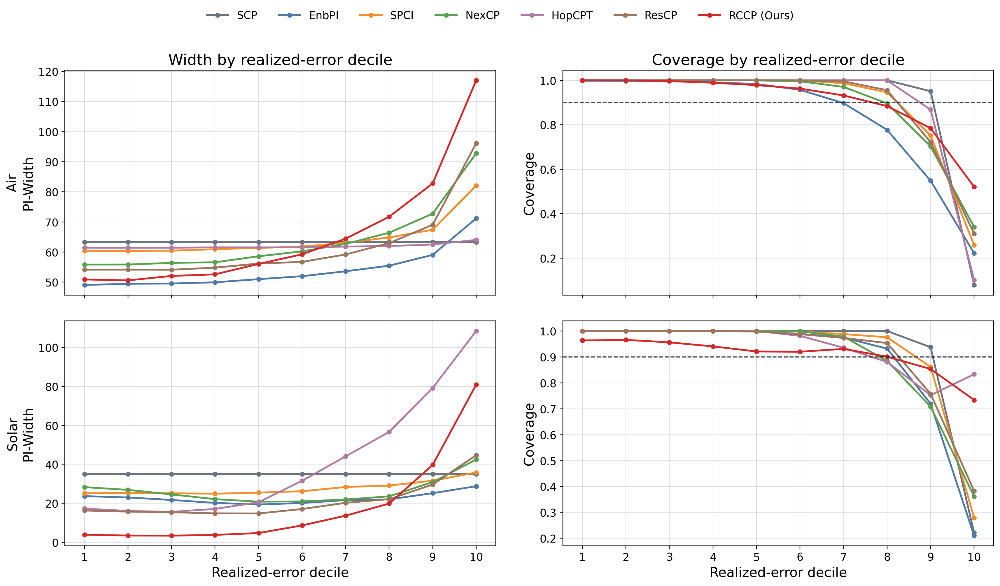
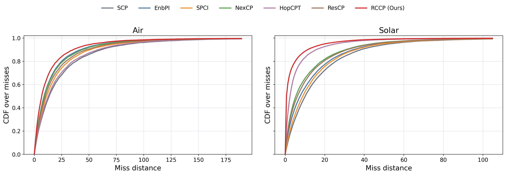

# Retrieval-Corrected Conformal Prediction for Time Series

Official implementation of the [CIKM 2026](https://cikm2026.diag.uniroma1.it/) paper **Retrieval-Corrected Conformal Prediction for Time Series** 🇮🇹. This package contains the code, configurations, source data, checkpoints, and processed figure values needed to reproduce the main alpha 0.1 analysis from the paper.

<p align="center">
  
</p>

## Experimental Scope

- **Datasets:** Air, Solar, Wind, and Electricity.
- **Backbones:** LSTM and Transformer forecasters.
- **Methods:** SCP, EnbPI, SPCI, NexCP, HopCPT, ResCP, and RCCP.
- **Metrics:** signed coverage gap, PI-Width, Winkler score, and calibration time.
- **Included files:** source data, trained forecasting checkpoints, processed figure values, and rendered paper figures.

## Quick Start

```bash
conda env create -f environment.yml
conda activate rccp-repro
bash run_reproduce.sh
```

The command regenerates the analysis figures under `outputs/figures/` from the included processed values. The environment file also includes the dependencies needed to rerun the reported baselines from the provided source data and checkpoints.

## Main Table at Alpha 0.1

<p align="center">
  
</p>

RCCP has the lowest average Winkler score in every dataset-backbone block, while keeping coverage gaps close to the nominal target.

## Winkler-Coverage-Time Trade-off

<p align="center">
  
</p>

This summary compares the average Winkler score against absolute coverage gap and calibration time.

## Winkler Decomposition

<p align="center">
  
</p>

This figure separates interval width from miss penalty, showing that RCCP reduces the costly miss component.

## Error-Decile Width and Coverage

<p align="center">
  
</p>

This figure checks whether each method widens intervals on harder realized-error deciles while maintaining coverage.

## Miss-Distance CDF

<p align="center">
  
</p>

This CDF shows how far missed observations fall outside the interval, conditional on a miss.

## Code Layout

- `data/figure_values/`: processed values used by the analysis figures.
- `data/source/`: source benchmark data used by the four datasets.
- `checkpoints/`: trained LSTM and Transformer forecasting model weights.
- `outputs/figures/`: rendered main table and analysis figures.
- `src/`: source code and configuration files for optional full regeneration.
- `scripts/`: compact scripts that regenerate the figures from the included artifacts.

## Runtime Note

Calibration time starts after the forecasting model has produced its point predictions. For RCCP, we also include the time needed to save the hidden-state vectors that RCCP retrieves from.

## Optional Regeneration

The included checkpoints can be used to regenerate forecast predictions and state representations from `data/source/` with the code under `src/`.

For a full regeneration run, use the same method and dataset configuration with seeds `0`, `1`, `2`, `3`, and `4`.
